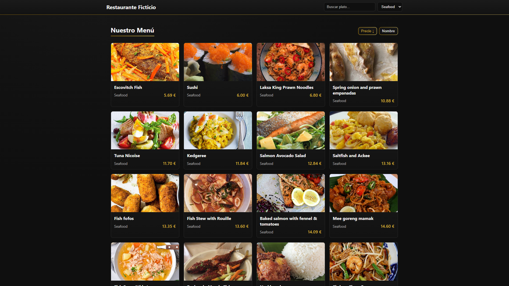

# DAD API Restaurant — Menú de Restaurante (SPA)

Aplicación de una sola página en React que muestra el menú de un restaurante consumiendo la API pública de TheMealDB. Se inventan precios en euros y se ofrecen buscador, selector de categorías y ordenación.

## Captura de pantalla



## Características

- Carga de platos desde TheMealDB usando fetch + useEffect.
- Datos normalizados con: id, name, category, thumb y price (precio aleatorio en €).
- Estados de carga y error visibles: Loading… y mensaje descriptivo.
- Componentes: `App`, `Header`, `MenuPage`, `MenuList`, `MenuItem`.
- UI: buscador por nombre y dropdown de categorías (Seafood, Dessert) en el header.
- Ordenación: por precio y por nombre (asc/desc) junto al título del listado.
- Estilos responsive en grid, paleta negro + dorado con gradientes metálicos.

## Tech Stack

- React + Vite
- CSS plano (sin frameworks) con variables CSS y gradientes

## Endpoints utilizados

- Seafood: https://www.themealdb.com/api/json/v1/1/filter.php?c=Seafood
- Dessert: https://www.themealdb.com/api/json/v1/1/filter.php?c=Dessert

La API devuelve `meals[]` con `idMeal`, `strMeal`, `strMealThumb`.

## Estructura de carpetas (relevante)

```
src/
  App.jsx
  App.css
  components/
    header/
      Header.jsx
      Header.css
    menuList/
      MenuList.jsx
      MenuList.css
    menuItem/
      MenuItem.jsx
      MenuItem.css
    footer/
      Footer.jsx
      Footer.css
  pages/
    menuPage/
      MenuPage.jsx
      MenuPage.css
```

## Cómo ejecutar

Requisitos: Node.js 18+ recomendado.

```bash
npm install
npm run dev
```

Build de producción y previsualización:

```bash
npm run build
npm run preview
```

## Detalles de implementación

- Carga de datos: en `MenuPage.jsx` se disparan dos peticiones `fetch` en paralelo (Seafood y Dessert), se normalizan y se combinan.
- Precios: se generan aleatoriamente por ítem (rango 5€–30€, con dos decimales).
- Filtros: búsqueda por nombre (case-insensitive) y categoría (`all`, `Seafood`, `Dessert`).
- Ordenación: botones “Precio” y “Nombre” alternan asc/desc y muestran indicador de dirección.
- Estilos: variables CSS en `App.css` con paleta negro+dorado y gradientes para aspecto metálico; tarjetas con hover suave.
- Accesibilidad: etiquetas ocultas para inputs, focus visible en controles, contraste suficiente.

## Estados de carga y error

- Mientras se cargan los datos, se muestra “Loading…”.
- Si ocurre un error de red/parseo, se muestra un mensaje en la página.

> Nota: con React 18 + StrictMode en desarrollo, ciertos efectos pueden ejecutarse dos veces. No afecta al build de producción.

## Personalización rápida

- Cambia el dorado: edita `--gold-1/2/3` y `--accent` en `src/App.css`.
- Ajusta los gradientes globales (fondo) en `body{ background-image: ... }`.
- Añade/elimina categorías: edita `ENDPOINTS` y `availableCategories` en `src/pages/menuPage/MenuPage.jsx`.

## Extras posibles (no incluidos o mínimos)

- Paginación o carga incremental.
- Carrito de compra.
- Persistencia de filtros en la URL (query params).

## Licencia

Uso educativo.